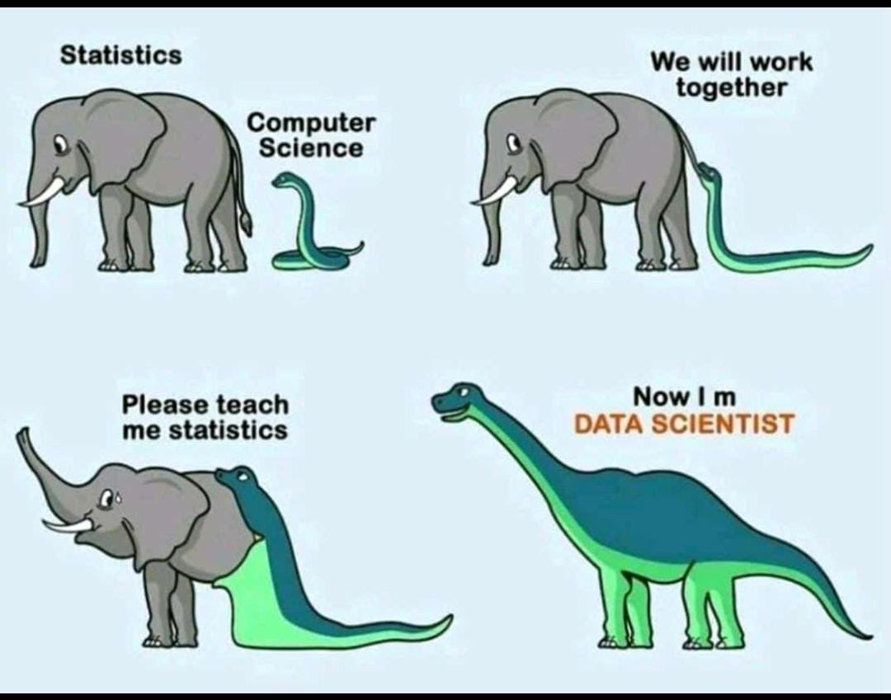

# Hello visitor

## Links for students
- [huggingface.co](https://huggingface.co)
- [keras.io](https://keras.io)
- [paperswithcode.com](https://paperswithcode.com)
- [Friedburg on AI](https://youtube.com/clip/UgkxBwg5h606JSZay_5fl07nodxKSeCjc1YQ)
- [Day 1 slides](https://docs.google.com/presentation/d/1b8Cbh9xnC3OpuyP9uvQT21bfVpx5IGU4Y0u7JrD_s7c)

## Links for vet students
- [acp-usa.org](https://www.acp-usa.org)
- [fourblock.org](https://fourblock.org)

# Tech & Data Science Resources

## 🚀 Groups & Communities

### General Tech & Data Science Groups

- [AWS User Groups](https://aws.amazon.com/developer/community/usergroups/) - Find AWS-focused meetups.
- [Data Science Salon (DSS)](https://www.datascience.salon/) - AI and data science industry insights.
- [GDG NYC](https://gdg.community.dev/gdg-nyc/) - Google Developer Group NYC.
- [IBM Developer Community](https://developer.ibm.com/) - Resources, events, and learning materials from IBM.
- [Microsoft Reactor](https://developer.microsoft.com/en-us/reactor/) - Community for developers & tech enthusiasts.
- [Microsoft Student Ambassadors](https://mvp.microsoft.com/studentambassadors) - Microsoft-backed student program.
- [NYC OWASP Chapter](https://owasp.org/www-chapter-nyc/) - The New York City chapter of the Open Web Application Security Project, focused on web security.
- [ISACA New York Chapter](https://engage.isaca.org/newyorkchapter/home) - The New York chapter of ISACA, focusing on IT governance, risk, and security.
- [PyData NYC (NumFOCUS)](https://nyc.pydata.org/) - Python and data science community.

### Developer & Programming Communities

- [Dev.to](https://dev.to/) - Developer-driven content and discussions.
- [FreeCodeCamp](https://www.freecodecamp.org/) - Free coding education.
- [GitHub Community](https://github.com/community) - Engage with other developers on GitHub.
- [HackerRank Community](https://www.hackerrank.com/) - Competitive coding and challenges.
- [Reddit Developer Communities](https://www.reddit.com/r/programming/) - Subreddit for coding discussions.
- [Stack Overflow](https://stackoverflow.com/) - Q&A platform for programming.
- [Women Who Code](https://www.womenwhocode.com/) - Empowering women in tech.

## 📅 Tech Events in NYC

- [Google Cloud Next NYC](https://cloud.withgoogle.com/next) (Every spring) - Google Cloud updates & trends.
- [MongoDB.local NYC](https://www.mongodb.com/events/mongodb-local/nyc) (Every spring) - MongoDB's developer event.
- [Microsoft Build NYC](https://build.microsoft.com) (Annually in May) - Microsoft’s dev conference.
- [AWS Summit New York](https://aws.amazon.com/events/summits/new-york/) (Every summer) - AWS cloud conference.
- [TECHSPO New York](https://techsponyc.com/new-york-software-development-events/) (Usually in July) - Tech expo featuring new innovations.
- [O’Reilly Strata Data & AI Conference NYC](https://conferences.oreilly.com/strata) (Annually in September) - Data & AI industry conference.
- [AI Summit New York](https://newyork.theaisummit.com) (Annually in December) - AI and enterprise-focused event.

## 🎥 YouTube Channels & Podcasts

- [Abdul Bari](https://www.youtube.com/c/AbdulBari) → Algorithms and data structures.
- [a16z Podcast](https://a16z.com/podcasts/) → Discussions on tech, culture, and innovation from Andreessen Horowitz.
- [Alex The Analyst](https://www.youtube.com/c/AlexTheAnalyst) → Data analytics and BI.
- [All In Podcast](https://www.youtube.com/c/AllInPodcast) → Tech, startups, and business trends.
- [Andrej Karpathy](https://www.youtube.com/c/AndrejKarpathy) → Machine Learning and AI.
- [Cloud Advocate (Azure)](https://www.youtube.com/c/AzureDevelopers) → Official Microsoft Azure channel.
- [David Bombal](https://www.youtube.com/c/DavidBombal) → Cybersecurity and networking.
- [Fireship](https://www.youtube.com/c/Fireship) → Short videos on cloud, programming, and dev trends.
- [FreeCodeCamp](https://www.youtube.com/c/FreeCodeCamp) → Programming tutorials on Python, SQL, data science, and cloud.
- [Jack Herrington](https://www.youtube.com/c/JackHerrington) → Full-stack development, Next.js, and DevOps.
- [NetworkChuck](https://www.youtube.com/c/NetworkChuck) → Cloud, DevOps, and security tutorials.
- [Online PM Courses - Mike Clayton](https://www.youtube.com/c/OnlinePMCourses) → Project management.
- [Tech With Tim](https://www.youtube.com/c/TechWithTim) → Python, machine learning, and cloud.
- [TechWorld with Nana](https://www.youtube.com/c/TechWorldwithNana) → Cloud, DevOps, and Kubernetes.
- [ThePrimeagen](https://www.youtube.com/c/ThePrimeagen) → Software engineering and cloud content.
- [Traversy Media](https://www.youtube.com/c/TraversyMedia) → Web development, JavaScript, and cloud tech.

## 📸 Instagram Accounts

- [@awscloud](https://www.instagram.com/awscloud) → AWS cloud news and updates.
- [@cybersecurity_news](https://www.instagram.com/cybersecurity_news) → Cybersecurity updates.
- [@datasciencedojo](https://www.instagram.com/datasciencedojo) → Data science memes & tutorials.
- [@devslopes](https://www.instagram.com/devslopes) → Cloud and software dev tips.
- [@freecodecamp](https://www.instagram.com/freecodecamp) → Programming tutorials & tech insights.
- [@girlknowstech](https://www.instagram.com/girlknowstech) → Women in tech and data science.
- [@hackingbutlegal](https://www.instagram.com/hackingbutlegal) → Cybersecurity tips.
- [@microsoftazure](https://www.instagram.com/microsoftazure) → Microsoft Azure insights.
- [@techinsider](https://www.instagram.com/techinsider) → Tech trends and news.
- [@techwitheaze](https://www.instagram.com/techwitheaze) → Data science, coding tips.

## 📩 Newsletters

- [Chamath Palihapitiya's Substack](https://substack.com/profile/8485-chamath-palihapitiya) - Business & tech insights.
- [Data Elixir](https://dataelixir.com/) - Weekly newsletter on data science trends.
- [Inside AI](https://inside.com/campaigns/inside-ai-27892) - AI industry insights.
- [Machine Learning Weekly](https://machinelearningweekly.com/) - ML research & industry trends.
- [SC Magazine US](https://www.scmagazine.com/) - Cybersecurity news and updates.
- [The Data Science Roundup](https://www.datascienceroundup.com/) - Data science trends & news.
- [The Pragmatic Engineer](https://thepragmaticengineer.substack.com/) - Software engineering insights.
- [TLDR Newsletter](https://tldr.tech/) - Daily updates on CS & tech news.

---

💡 *Got more to add?* Send us an email!
